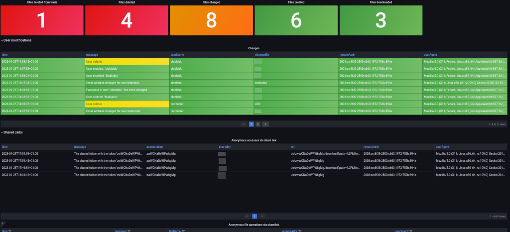

# grafana-nextcloud-audit-dashboard
Grafana dashboard for viewing Nextcloud audit logs with data collected by Loki

# Features:
- Login monitoring
- Rights changes in user and file context
- Access monitoring of public shares
- Password changes

This dashboard uses Nextcloud audit logs, which must first be enabled in the Nextcloud configuration and is not compatible with the normal Nextcloud logs.

Check out my [website](https://okxo.de/monitor-your-nextcloud-logs-for-suspicious-activities/) to see how to implement the dashboard.\
This dashboard is posted on [Grafana's dashboards section](https://grafana.com/grafana/dashboards/17971-nextcloud-audit-logs/). 

# Alert rules
See [nextcloud.yaml](nextcloud.yaml) file for some examples of Loki alert rules that you can use in conjunction with this dashboard and Prometheus Alertmanager.

# License
Licensed under the terms of GNU General Public License v3.0. See LICENSE file.
